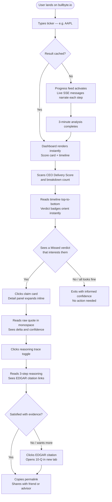
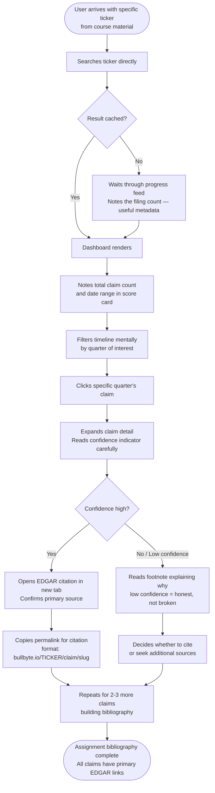
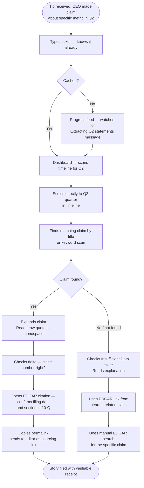

# UX Design Specification BullByte

**Author:** Aditi
**Date:** 2026-04-29

---

<!-- UX design content will be appended sequentially through collaborative workflow steps -->

## Executive Summary

### Project Vision

BullByte is a promise-tracking research dashboard for public companies. It surfaces a per-company CEO Delivery Score — backed by a fully auditable reasoning trail linking every verdict to its primary SEC EDGAR source — giving retail investors, finance students, and journalists a trustworthy, evidence-backed answer to "can I trust this management team?"

### Target Users

- **Primary — Retail Investor (Priya):** Analytically curious, time-constrained, no institutional data access. Needs fast, credible, self-explanatory results with no tutorial required.
- **Secondary — Finance Student (Rohan):** Needs citable structured data with direct links to primary EDGAR sources and filterable confidence scores for academic research.
- **Secondary — Journalist (Sarah):** Needs claim-level receipts fast — exact quotes, quarter-by-quarter navigation, and side-by-side revision evidence.

### Key Design Challenges

1. **Managing a 3-minute wait** — the live progress feed is the sole trust and engagement mechanism during fresh analysis; every step message must feel informative, never generic or silent.
2. **Three-depth information hierarchy** — the same data must work glanceably (timeline), at-a-card (claim card), and in full detail (reasoning trace) simultaneously, each level complete in itself.
3. **Trust through visible reasoning** — the reasoning trace must serve both a retail investor (accessibility) and a finance student (citability) without overwhelming or under-serving either.
4. **Score as transparent authority** — institutional credibility with radical plain-language explainability in a single component.

### Design Opportunities

1. **The "receipts" metaphor** — designing the reasoning trace to feel like journalism evidence (not a debug log) could be a signature UX moment users share and cite.
2. **Progress feed as product storytelling** — the wait demonstrates the depth of work BullByte does; designed well, the wait sells the product.
3. **Honest uncertainty as differentiator** — low-confidence, pending, and Insufficient Data states are trust signals, not embarrassments; designing them with clarity and honesty is a competitive advantage.

## Core User Experience

### Defining Experience

BullByte has a single defining interaction loop: **search → wait → browse → verify**. A user types a ticker, watches the system work step by step, reads a chronological promise timeline, and drills into any claim to see the evidence behind the verdict. There are no branching workflows, no user accounts, no settings. The product is entirely read-only. Every design decision should serve this loop and remove anything that interrupts it.

### Platform Strategy

- **Primary platform:** Desktop web (≥1280px) — full three-panel dashboard (score card + timeline + claim detail) visible simultaneously
- **Secondary:** Tablet (768px–1279px) — vertically stacked panels, all content accessible
- **Minimum viable:** Mobile (≥320px) — single column, readable, no broken layouts; full mobile UX not required for Phase 1
- **Input:** Mouse + keyboard; no touch-first interactions required
- **Rendering:** Client-side Angular SPA; no offline, no PWA, no SSR in Phase 1
- **URL stability:** Every ticker and every claim has a permanent, shareable URL — the product is designed to be cited and linked

### Effortless Interactions

Three interactions must require zero thought or learning:

1. **Search:** Type a ticker symbol, press Enter. No autocomplete dropdown, no account, no filters. Immediate result or clear "not found" state.
2. **Timeline reading:** Verdict status communicates instantly via colour + text label. A user must understand Delivered vs Missed in under 3 seconds without reading any documentation.
3. **Claim detail:** One click on any claim card reveals the complete detail — raw quote, verdict, delta, confidence, EDGAR link. No secondary navigation, no "see more", no page transition.

### Critical Success Moments

1. **The wait earns trust** — during a fresh analysis, each progress message ("Found 8 quarterly filings... Verifying claim 3 of 14...") demonstrates the depth of work no human could do in 3 minutes. The wait must feel like watching BullByte work, not waiting for a spinner.
2. **The first reasoning trace** — the moment a user expands the reasoning trace and sees an inline EDGAR citation linking to a specific 10-Q filing is the moment BullByte stops feeling like an AI summary and starts feeling like a research tool. This is the trust-earning moment.
3. **The score unpacks** — clicking through from a CEO Delivery Score to the exact claims and outcomes behind it must feel like a journalist finding their receipts — satisfying, not overwhelming.

### Experience Principles

1. **Evidence first, score second** — the CEO Delivery Score is a summary of the evidence, not a replacement for it. Every number must be one click away from its source.
2. **Zero friction to the first insight** — no login, no onboarding, no tutorial. A first-time user types a ticker and sees a verdict within one interaction.
3. **Transparency is the product** — the reasoning trace is not a "details" panel. It is the primary value proposition. Design it accordingly.
4. **Honest uncertainty is a feature** — low-confidence verdicts, pending claims, and Insufficient Data states must be visually distinct and clearly explained, never hidden or minimised. They signal rigour, not failure.

## Desired Emotional Response

### Primary Emotional Goals

BullByte should make users feel **confident and informed** — not excited or delighted, but certain. Users arrive suspicious of management claims; they should leave knowing exactly how much of that suspicion is warranted, with evidence they can show others. The differentiating emotion is **vindicated**: "I have the receipts now."

### Emotional Journey Mapping

| Stage | Target Emotion | Design Driver |
|---|---|---|
| First arrival | Curious + intrigued | Clean, purposeful UI signals seriousness |
| Ticker search | Hopeful | Frictionless, immediate feedback |
| Analysis progress feed | Impressed | Step messages reveal real analytical depth |
| Promise timeline | Oriented | Instant verdict comprehension via colour + label |
| Claim card | Informed | Precise data: quote, speaker, metric, delta |
| Reasoning trace | Trusting | Inline EDGAR citation — "this is verifiable" |
| Low-confidence verdict | Respected | Honesty about uncertainty signals rigour |
| Sharing a claim URL | Authoritative | "I have receipts" |

### Micro-Emotions

- **Confidence over confusion** — every state (loading, error, low-confidence, pending) must be explained in plain language; no ambiguous spinners or blank panels
- **Trust over scepticism** — evidence (EDGAR citations, delta calculations) must be visible without requiring the user to ask for it
- **Calm over anxiety** — the 3-minute wait must feel purposeful, not broken; the progress feed is the anxiety-management mechanism
- **Accomplishment over frustration** — a user who finds a Missed verdict should feel like they discovered something, not like the tool failed them

### Design Implications

- **Confident** → Clean typography hierarchy; data-dense but never cluttered; generous whitespace around verdict badges so they read as authoritative
- **Trusting** → Reasoning trace designed as evidence, not debug output; EDGAR citations styled as footnotes/references, not raw URLs
- **Impressed** → Progress feed messages written as journalistic narration ("Reviewing 14 forward-looking statements from Q3 2024 earnings call"), not system log entries ("processing_step_3")
- **Respected** → Low-confidence and Insufficient Data states use the same visual weight as high-confidence states — never visually diminished or hidden
- **Calm** → Progress feed never goes silent; if a step takes longer than expected, an intermediate "still working..." message appears

### Emotional Design Principles

1. **Authority through evidence, not assertion** — the score earns its credibility by being immediately unpick-able into source citations; design must make this path obvious and satisfying
2. **Honesty as a design value** — uncertainty states are designed with the same care as success states; they are not edge cases, they are first-class
3. **Narrate the work** — the system's intelligence is invisible unless the UI surfaces it; progress messages, reasoning steps, and confidence scores all make the invisible visible
4. **Calm is earned, not assumed** — the user arrives stressed (a management team they're unsure about); they leave calm because the data is clear; the design must facilitate this transition without adding friction

## UX Pattern Analysis & Inspiration

### Inspiring Products Analysis

**1. Perplexity AI — inline citation model**
Perplexity pioneered weaving source citations directly into AI-generated prose rather than listing them separately. Each factual statement has a numbered citation that expands inline. This is exactly the pattern BullByte's reasoning trace needs — citations feel like footnotes in an academic paper, not debug logs. Users trust the answer more because they can see where each piece came from without leaving the reading flow.
*Key pattern:* Citation as inline annotation, not a separate "sources" panel.

**2. Bloomberg / Robinhood — verdict-at-a-glance colour systems**
Financial products have solved the "colour + meaning without colour alone" problem. The pattern: colour is the first signal, text label is the confirmation, number is the detail. A user scans colour, pauses at a label, clicks for the number.
*Key pattern:* Three-tier information density — colour → label → number — on a single card.

**3. Linear / Notion — data-dense but calm interfaces**
Linear renders a huge volume of structured data without chaos. The secret: consistent typographic hierarchy, tight spacing within cards, generous spacing between cards, and muted colours for metadata vs. prominent colours for status.
*Key pattern:* Muted metadata (speaker attribution, quarter label) + prominent status (verdict badge) within a tight card grid.

**4. NYT / FT — editorial seriousness as trust signal**
Trust through typographic restraint — a limited type scale, generous line height, disciplined use of a single accent colour. Institutional credibility through restraint, not decoration.
*Key pattern:* Typographic restraint as a trust signal; data tables that prioritise legibility over visual flair.

### Transferable UX Patterns

**Navigation:**
- **Single-page drill-down** — claim detail opens as an in-context panel within the company page, not a new route; timeline context remains visible
- **Persistent context header** — ticker symbol, CEO score, and last-analysed date stay visible while the user drills into any claim

**Interaction:**
- **Progressive disclosure** — reasoning trace collapsed by default, expanding on user demand; never force full detail on arrival
- **Citation preview** — EDGAR filing references in reasoning trace steps show a tooltip preview (filing type, date, section) before opening in a new tab

**Visual:**
- **Signed delta display** — numeric delta (e.g. `−$8M`, `+2.1%`) shown alongside the verdict badge; delta is secondary to verdict, not primary
- **Low-confidence as footnote** — asterisk + footnote-style note below the card rather than a warning banner; honest without being alarming

### Anti-Patterns to Avoid

- **Dashboard overload** — Bloomberg-style pixel-dense data is for traders, not retail investors; density is the enemy of comprehension for BullByte's audience
- **AI chatbot aesthetic** — reasoning trace must not look like a ChatGPT conversation log; bubble-style UI would undermine the "serious research tool" positioning
- **Confidence theatre** — coloured progress bars or percentage circles make confidence look more precise than it is; plain text labels ("High / Low confidence") with a footnote are more honest and more trusted
- **Dead-end error states** — Insufficient Data and Pending states must explain *why* and *what happens next*, never just "Data unavailable"

### Design Inspiration Strategy

**Adopt directly:**
- Perplexity's inline citation model for reasoning trace steps
- Linear's progressive disclosure (collapsed → expanded on demand)
- Bloomberg's three-tier card density (colour → label → number)

**Adapt for BullByte:**
- NYT/FT typographic restraint → applied to a sans-serif system (Angular SPA context), keeping the restraint without the serif heritage
- Robinhood's colour system → extended to five verdict states (DELIVERED, MISSED, PENDING, INSUFFICIENT_DATA, REVISED), with text labels mandatory alongside every colour use

**Avoid entirely:**
- Dashboard-style data density — BullByte is a research tool, not a terminal
- Chat/bubble UI for reasoning traces — use a structured step list, not a conversation metaphor
- Percentage circles or progress bars for confidence — use plain text labels

## Design System Foundation

### Design System Choice

**Custom Design Token System + Angular CDK + SCSS**

BullByte will use a bespoke design token system implemented as CSS custom properties and SCSS variables, with Angular CDK providing accessibility primitives (focus trap, overlay positioning, live announcements). No third-party component framework is used.

### Rationale for Selection

- **Component scope is small and well-defined** — BullByte has ~8–10 core components; building them custom is achievable and gives full control
- **Editorial aesthetic requires no framework opinions** — Angular Material's Material Design and ng-zorro's Ant Design visual languages conflict with the restraint and authority BullByte needs; a custom system starts clean
- **Token-first workflow suits the designer** — defining tokens (colour, type, spacing) then implementing them as CSS custom properties is a simpler designer→developer handoff than mapping specs to a library's component model
- **Angular 21 standalone compatibility** — SCSS component-scoped styles pair natively with standalone components; no NgModule-level style leakage

### Implementation Approach

1. **Tokens first** — Designer delivers token definitions (colours, type scale, spacing scale, verdict palette) as a named-value document; devs implement as CSS custom properties in `styles.scss`
2. **Shared component library** — Built in `frontend/src/app/shared/components/`: `VerdictBadgeComponent`, `ConfidenceIndicatorComponent`, `DisclaimerFooterComponent` — consumed across all features
3. **Feature components** — Built in their feature folder using shared tokens and components; no cross-feature component imports
4. **Angular CDK** — Used for: focus trap (claim detail panel), overlay positioning (tooltip previews on EDGAR citations), live region announcements (progress feed SSE updates for screen readers)

### Customization Strategy

- **CSS custom properties** for all token values — allows runtime theming if needed in Phase 2 without a rebuild
- **SCSS mixins** for recurring patterns (card layout, verdict colour application, responsive breakpoint handling)
- **No global style overrides** — every component's styles are scoped; `styles.scss` contains only tokens, resets, and typography base styles
- **Verdict colour tokens** defined as semantic pairs: `--color-verdict-delivered-bg` / `--color-verdict-delivered-text`, repeated for all five verdict states — always used as pairs to enforce colour + label accessibility rule

## Defining Core Experience

### Defining Experience

**BullByte in one sentence:** *"Search a ticker, get a promise verdict — with the receipts."*

Where Tinder's defining interaction is "swipe to match," BullByte's is: **type a ticker, see what management promised, see if they delivered, tap the claim, read the primary source**. The receipts are the product. Users don't describe BullByte as "an AI analyser" — they describe it as "the tool that shows you when a CEO lied in an earnings call."

The interaction that, if nailed, makes everything else follow: **a single-click path from a CEO's spoken promise to the SEC filing that proves or disproves it**.

### User Mental Model

Retail investors, students, and journalists arrive at BullByte with a shared suspicion: management teams say things in earnings calls that don't always match reality, and finding out requires reading hundreds of pages of filings. Their current approach is one of three:

- **They don't check at all** — too much work, so they trust or don't trust management intuitively
- **They skim 10-K/10-Q search results** — a painful, unsystematic process that takes hours and may miss revisions
- **They use professional terminals** — expensive, built for traders, not promise-tracking

The mental model users bring: *this is a search problem*. They expect BullByte to feel like a very smart search engine, not a dashboard or a chatbot. The ticker field is the entry point, and everything downstream should feel like the search results — browsable, filterable, citable.

Where users expect friction: the wait. Users will interpret a multi-minute wait as broken unless the system actively narrates what it is doing. This is a major expectation gap that the progress feed must bridge.

Where users will be surprised (positively): the depth. They expect summaries; they get inline primary sources. The first time a user sees an actual 10-Q passage in a reasoning trace, the product exceeds their expectations. This is BullByte's "wow moment."

### Success Criteria

The core experience is successful when:

1. **First verdict in under 3 seconds of page load** — for a cached ticker, the promise timeline renders before the user has time to wonder if it's working
2. **Primary source visible within one click** — clicking any claim card surfaces the EDGAR citation without a page transition; the user never loses their place in the timeline
3. **A user can explain the verdict to someone else** — the verdict label, delta, and one-line reasoning excerpt give enough information for a user to relay the finding confidently without having to read the full reasoning trace
4. **Low-confidence verdicts feel honest, not broken** — a user who encounters an Insufficient Data verdict understands immediately why BullByte couldn't make a call, without reading documentation
5. **The wait feels shorter than it is** — a user who waits 3 minutes for a fresh analysis should, when asked, estimate they waited 90 seconds; the progress feed earns this

### Novel UX Patterns

BullByte combines established patterns with one genuinely novel pattern:

**Established (adopt directly):**
- Ticker search — identical mental model to stock quote lookups; no user education needed
- Progress feed / live log — familiar from build logs, background jobs, file uploads
- Expandable detail panels — accordion and drill-down patterns are universal

**Novel (requires deliberate design):**
- **Verdict-with-receipts** — presenting an AI-generated verdict *alongside the primary source that the verdict was derived from*, inline and without a page transition. This is not a chatbot citation, not a footnote list, and not a "see sources" link. It is an integrated evidence-verdict unit. No common consumer product does this today. The closest analogy is Perplexity's inline citations, but applied to a structured financial verdict rather than prose.

**Education strategy for the novel pattern:**
- No tutorial required — the EDGAR citation appears naturally in the reasoning trace as a styled link with filing type and date; curiosity drives the first click
- The first inline citation is the "aha" moment; the design must ensure it is visually distinctive enough to invite the click without requiring explanation
- No empty space, no "how this works" overlay — the pattern teaches itself on first use

### Experience Mechanics

**The full flow, step by step:**

**1. Initiation**
The user arrives at a clean search-focused landing page. A single text field with placeholder "Enter ticker symbol (e.g. AAPL)" and a search button. No login, no filters, no navigation distractions. The call to action is unambiguous. Previous searches may be listed in browser history (URL-stable results), but no BullByte-managed history is shown.

**2. Interaction**
- *Cached result:* Ticker submitted → immediate render of company header, CEO Delivery Score card, and chronological promise timeline. No loading state except a brief skeleton.
- *Fresh analysis:* Ticker submitted → progress feed activates. Each message is written as journalism narration: "Scanning SEC EDGAR for quarterly filings… Found 11 10-Q filings dating to Q1 2022… Extracting forward-looking statements from earnings calls… Verifying claim 6 of 17 against Q3 2023 10-Q…" The user watches BullByte work.
- *Claim interaction:* User clicks any promise card in the timeline → an inline detail panel expands beneath the card (no page transition). The panel shows: raw quote, speaker, quarter, verdict badge, numeric delta, confidence indicator, EDGAR citation preview, and collapsible reasoning trace.

**3. Feedback**
- During fresh analysis: progress messages arrive via SSE, each replacing the previous; a counter ("Claim 6 of 17") shows progress; a "still working…" heartbeat appears if 30+ seconds pass without a new message
- During browsing: verdict badges use colour + text label simultaneously; expanding a claim card gives immediate visual confirmation (smooth expand animation, detail panel highlights briefly)
- On error: if EDGAR is unreachable or the ticker is not found, a plain-language message appears in the same space as the progress feed — never a raw error code, always a next step ("Try again" or "Check the ticker format")

**4. Completion**
- For the browsing user: there is no explicit "done" state — the timeline is browsable indefinitely; users complete the task in their own mind when they have found what they were looking for
- For the sharing user: every claim card has a permanent URL; copying the URL gives a link directly to that claim's expanded state — the "I have the receipts" moment is made shareable with zero friction
- For the researching user: the EDGAR citation opens the primary filing in a new tab; BullByte remains open; the user can cross-reference and return

## Visual Design Foundation

### Color System

BullByte's colour system is built around a single foundational principle: **institutional authority through restraint**. No gradient packs, no decorative palettes. One primary accent, a warm neutral surface scale, and a strictly semantic verdict palette.

**Surface Scale**

| Token | Value | Use |
|---|---|---|
| `--color-surface-base` | `#F4F4F0` | Page background — warm off-white, not clinical |
| `--color-surface-raised` | `#FFFFFF` | Card backgrounds — clear separation from page |
| `--color-surface-overlay` | `#FAFAF8` | Reasoning trace background — subtle depth |
| `--color-border` | `#E5E5E1` | Dividers, card outlines — warm, not grey |

**Text Scale**

| Token | Value | Use |
|---|---|---|
| `--color-text-primary` | `#1A1A1A` | Headings, claim quotes, primary content |
| `--color-text-secondary` | `#6B6B6B` | Metadata — speaker attribution, quarter labels |
| `--color-text-tertiary` | `#9B9B9B` | Timestamps, footnote text, confidence labels |
| `--color-text-link` | `#1E3A5F` | EDGAR citation links — deep navy, authoritative |

**Brand Accent**

| Token | Value | Use |
|---|---|---|
| `--color-accent-primary` | `#1E3A5F` | CEO Delivery Score ring, active states, links |
| `--color-accent-primary-light` | `#E8EEF4` | Accent tints for hover states, subtle highlights |

**Verdict Palette — Semantic Pairs (always used together)**

| Verdict | Background Token | Text Token | Bg Value | Text Value |
|---|---|---|---|---|
| DELIVERED | `--color-verdict-delivered-bg` | `--color-verdict-delivered-text` | `#D1FAE5` | `#065F46` |
| MISSED | `--color-verdict-missed-bg` | `--color-verdict-missed-text` | `#FEE2E2` | `#991B1B` |
| PENDING | `--color-verdict-pending-bg` | `--color-verdict-pending-text` | `#FEF3C7` | `#92400E` |
| INSUFFICIENT_DATA | `--color-verdict-insufficient-bg` | `--color-verdict-insufficient-text` | `#F3F4F6` | `#374151` |
| REVISED | `--color-verdict-revised-bg` | `--color-verdict-revised-text` | `#EDE9FE` | `#5B21B6` |

**Accessibility:** All colour pairs meet WCAG AA (4.5:1 minimum) on their respective backgrounds. Verdict colours are never used without their accompanying text label — colour is signal, label is confirmation.

### Typography System

**Typefaces**

- **Primary (UI + headings + body):** Inter — geometric sans-serif, designed for screen legibility, neutral enough to feel institutional without serif heritage
- **Monospace (raw quotes + EDGAR excerpts):** JetBrains Mono — visually distinguishes primary source material from analysis, signals "this is verbatim evidence"

**Type Scale (8px base grid)**

| Token | Size | Weight | Line Height | Use |
|---|---|---|---|---|
| `--type-display` | 32px | 700 | 1.2 | CEO Delivery Score numeral |
| `--type-heading-1` | 24px | 600 | 1.3 | Company name, page headings |
| `--type-heading-2` | 18px | 600 | 1.35 | Section headings, score label |
| `--type-heading-3` | 16px | 600 | 1.4 | Claim card title, verdict label |
| `--type-body` | 14px | 400 | 1.5 | Claim description, reasoning steps |
| `--type-body-sm` | 13px | 400 | 1.5 | Metadata, speaker attribution, quarter |
| `--type-caption` | 12px | 400 | 1.4 | Confidence label, footnote text |
| `--type-mono` | 13px | 400 | 1.6 | Raw claim quotes, EDGAR excerpts |

**Typographic Principles**
- **No bold body text** — bold is reserved for verdicts and headings; emphasis in body text uses colour and size contrast only
- **Monospace is a trust signal** — whenever text is drawn verbatim from a primary source, it renders in JetBrains Mono; users learn quickly that mono = primary evidence
- **Letter spacing:** `-0.01em` on headings ≥18px for refined feel; none on body text

### Spacing & Layout Foundation

**Base Unit: 4px** — all spacing values are multiples of 4.

**Spacing Scale**

| Token | Value | Primary Use |
|---|---|---|
| `--space-1` | 4px | Icon padding, fine-grained internal gaps |
| `--space-2` | 8px | Between timeline cards (tight, scannable) |
| `--space-3` | 12px | Internal card padding (compact) |
| `--space-4` | 16px | Standard card padding |
| `--space-6` | 24px | Between major card sections |
| `--space-8` | 32px | Between timeline sections (year dividers) |
| `--space-12` | 48px | Between page-level sections |
| `--space-16` | 64px | Page top/bottom breathing room |

**Layout Grid**

- **Max content width:** 1440px, centered
- **Page padding (horizontal):** 48px (desktop), 24px (tablet), 16px (mobile)
- **Desktop three-column layout:**
  - Score column: 300px fixed left
  - Timeline column: flex (fills remaining space)
  - Detail panel: 420px fixed right (slides in, does not displace timeline)
- **Tablet:** Score + timeline stacked vertically; detail panel becomes full-width drawer below timeline
- **Mobile:** Single column; score card → timeline → detail panel (sequential)

**Density Principles**
- Cards in the timeline are **compact by default** — 16px padding, 8px gap between cards; the timeline must feel scannable, not padded
- The reasoning trace is **relaxed** — 24px padding, 1.6 line height on monospace excerpts; the user is reading carefully here, not scanning
- White space is applied between sections, not within them; information is dense inside a card, but cards breathe against each other

### Accessibility Considerations

- **Colour + label mandatory rule:** No verdict state is communicated by colour alone; every badge renders both the colour token pair and the text label (`DELIVERED`, `MISSED`, etc.)
- **Focus indicators:** A visible 2px `--color-accent-primary` outline on all interactive elements (claim cards, EDGAR links, search input); never removed or hidden
- **Motion:** All animations ≤200ms and respect `prefers-reduced-motion` — progress feed transitions, card expand, panel slide-in all have a `@media (prefers-reduced-motion: reduce)` no-animation fallback
- **Screen reader live region:** Progress feed messages are announced via an `aria-live="polite"` region managed by Angular CDK's `LiveAnnouncer`; claim detail panel receives focus on expand via Angular CDK's focus trap
- **Minimum touch target:** 44×44px on all interactive elements (card click areas, copy link buttons, EDGAR citation links)
- **Contrast floor:** All text tokens on all surface tokens meet WCAG AA; text on verdict badge backgrounds meets WCAG AA (verified above)

## Design Direction Decision

### Design Directions Explored

Five complete screens were built and explored in an interactive HTML showcase (`ux-design-directions.html`): Landing/Search, Analysis Progress Feed, Dashboard with inline Claim Detail, Ticker Not Found, and Insufficient Data state. Each screen applied all established design tokens and patterns, allowing evaluation of the full visual language in real interface context.

### Chosen Direction

**Editorial Authority** — a single coherent visual direction applied consistently across all screens. Key characteristics:

- Warm off-white base surface (`#F4F4F0`) with white card surfaces — institutional without being clinical
- Deep navy (`#1E3A5F`) as the sole brand accent — authority through restraint, one colour doing all the work
- Compact timeline card grid (16px padding, 8px gap) — data-dense but not overwhelming
- JetBrains Mono for all primary source material (claim quotes, EDGAR excerpts) — monospace as a trust signal
- Five-state semantic verdict palette — DELIVERED green / MISSED red / PENDING amber / INSUFFICIENT_DATA grey / REVISED purple — always colour + label together, never colour alone

### Design Rationale

The Editorial Authority direction was chosen because it resolves the core tension in BullByte's audience: retail investors need glanceability, journalists need citability, students need credibility. A single restrained direction serves all three. The warm neutrals feel serious without the coldness of pure white Bloomberg-style terminals. The deep navy accent reads as institutional without being aggressive. The monospace evidence blocks are the signature moment — visually communicating "this text came from a primary source" without any label required.

Alternative directions (higher colour saturation, larger type scale, more visual separation between sections) were tested in the HTML exploration and rejected because they pushed BullByte toward dashboard territory — appropriate for traders, not for the promise-tracking research use case.

### Implementation Approach

The direction maps directly to the token system already defined in the Design System Foundation section. No additional tokens are needed. Implementation sequence for the designer:

1. Apply surface and text tokens to base layout (page, nav, card shells)
2. Implement verdict badge component using the five semantic colour pairs — this is the most visible token usage and validates the system fastest
3. Apply monospace tokens to all quote/excerpt blocks — the visual contrast with Inter body text is the key "trust signal" moment
4. Validate spacing scale on the timeline at compact density — 8px gaps between cards is tighter than most frameworks default; confirm it reads as intentional, not cramped
5. Test the deep navy accent on interactive states (focus, hover, active) — ensure it reads distinctly against both the warm surface and the white card background

## User Journey Flows

### Journey 1: Retail Investor — First-Time Research (Priya)

**Goal:** Arrive skeptical of a management team, leave with a defensible verdict.

**Critical moments:**
- **Dashboard render** — score and first verdict badge must land within 3 seconds for cached tickers; this is where trust begins
- **First Missed verdict** — colour + label must communicate the verdict before the user reads any text; this is the "hook" moment
- **First EDGAR citation click** — the moment BullByte stops feeling like AI and starts feeling like a research tool

### Journey 2: Finance Student — Citation Research (Rohan)

**Goal:** Find citable primary sources for an assignment on management credibility.

**Critical moments:**
- **Confidence indicator** — Rohan reads this more carefully than Priya; the footnote explanation on low-confidence verdicts is essential to his workflow
- **Permalink format** — the URL must be stable and shareable; `bullbyte.io/TICKER/claim/slug` is the citation format used in-text
- **EDGAR link** — must open the exact filing section, not just the company's EDGAR page, to be academically useful

### Journey 3: Journalist — Claim Verification Under Deadline (Sarah)

**Goal:** Verify a specific executive claim before a filing deadline; need the receipt, fast.

**Critical moments:**
- **Speed to the right quarter** — no filters exist, so timeline year dividers and claim titles must be scannable in seconds; Sarah does not read every card
- **Raw quote in monospace** — the first thing she checks; if the quote doesn't match her tip she needs to know immediately
- **EDGAR citation with section** — must include filing type, date, and §section so she can verify without re-navigating EDGAR herself

### Journey Patterns

**Navigation Patterns**
- **Single-entry, single-flow** — every journey starts at search; no alternative entry points, no "browse by sector." Simplicity is the pattern.
- **Inline drill-down, no page transitions** — all three personas drill into claim detail without leaving the dashboard; the timeline context remains visible
- **Permanent deep-link** — every journey ends with a shareable URL; this is the natural "export" for all three personas and requires zero friction

**Decision Patterns**
- **Colour as pre-attentive filter** — all three personas use verdict badge colour to pre-filter the timeline before reading any text; MISSED claims draw the eye first
- **Confidence as qualifier, not disqualifier** — Priya skips low-confidence claims, Rohan reads the footnote, Sarah proceeds cautiously; the same UI state serves all three
- **Monospace as trust anchor** — all three personas treat monospace quote blocks as the "real" data; the surrounding analysis is secondary in reading order

**Feedback Patterns**
- **Progress narration > spinner** — the progress feed is the sole feedback mechanism during fresh analysis; silence = broken; narration = working
- **Expand animation = invitation** — claim cards animate open smoothly; the only animation in the product, which makes it the deliberate "you clicked the right thing" confirmation
- **Error in plain English always** — no user in any journey encounters a raw HTTP status or empty panel without an explanation and a next step

### Flow Optimization Principles

1. **Zero clicks to first verdict** — the CEO Delivery Score and first timeline card are visible on load without any click; the user's first action is optional
2. **One click to primary source** — the path from any claim to its EDGAR filing is: click card → read reasoning step → click citation. Maximum two clicks, zero page loads
3. **Every dead end has an exit** — Insufficient Data, Ticker Not Found, and low-confidence states all explain why and offer a concrete next action
4. **Sharing is the last step of every journey** — all three personas end by sharing or citing; the permalink is always one click away from any claim detail view
